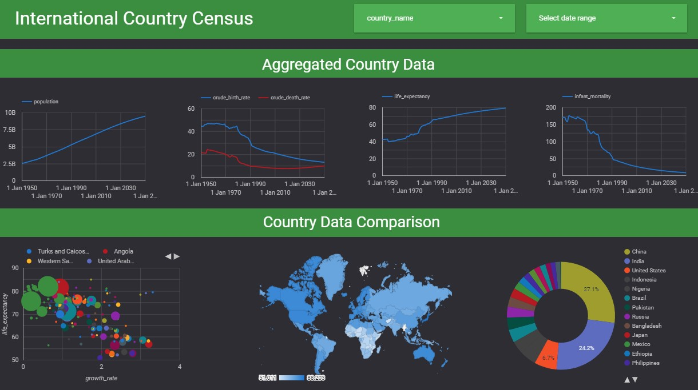

# International Country Census Dashboard

An interactive dashboard that displays statistics on the international country census based on the country name and the date range selected by the user. At the top of it, you can view the time series of the population, the crude birth date as well as the crude death rate, the life expectancy, and infant mortality. In addition, you can find out about life expectancy in relation to growth rate, the life expectancy as presented in a world map, and the rate of the average population of each country.

Live demo: https://datastudio.google.com/reporting/4d7e06ef-0d86-4468-ab4d-6670020fe406
